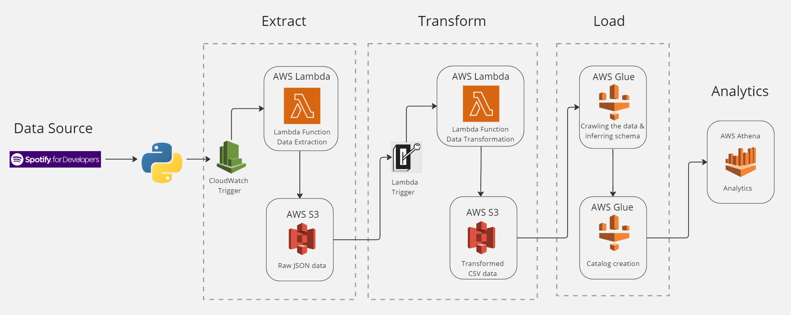

# AWS Data Engineering Project - Spotify data analysis

This project aims to enable data analysts of imaginary music firms to have queryable and up-to-date data available for analysis everyday. The data is of Spotify's top trending songs, which they can use for understanding audiences listening habits by applying data analytics. 
 
This project seeks to effectively set up a data pipeline that takes data straight from a Spotify API and transforms it into a form that can be analysed and presented in a query-friendly manner.  
To import, extract, and process the data and make it accessible for analysis, the data pipeline makes use of AWS services. 

Data source:
Portal of Spotify APIs -  [Spotify for Developers](https://developer.spotify.com/)

### Data Pipeline flowchart

 

### Highlights

* Data extraction via API
* Data cleansing
* Data transformation
* Data crawling 
* Data quering and analysis

### Main activities
* Integrating with Spotify API and extracting the data
* Using AWS S3 to store the files
* Deploying Python codes on AWS Lambda for Data Extraction, Transformation and Loading
* Adding triggers to schedule and run the functions automatically
* Building Data Catalogs of the data files using AWS Glue crawlers
* Analysing the tables using SQL in Athena

### AWS services used:

* Extraction:
    * Cloudwatch Trigger
    * Lambda Function
    * S3
* Transformation and loading:
    * Lambda Trigger 
    * Lambda Function
    * S3
* Data Catalogging
    * S3
    * Glue Crawlers
* Data Analysis
    * Athena Query Editor
* Other services
    * IAM

### File Formats Handled:

* JSON
* Pandas dataframe
* CSV

### Other Tools

* Jupyter Notebook - For preliminary analysis of the source data
* VS code - For deploing the project on Git
* Miro board - For creating Data Pipeline Diagram

### References

* https://datawithdarshil.com/
* https://aws.amazon.com/
